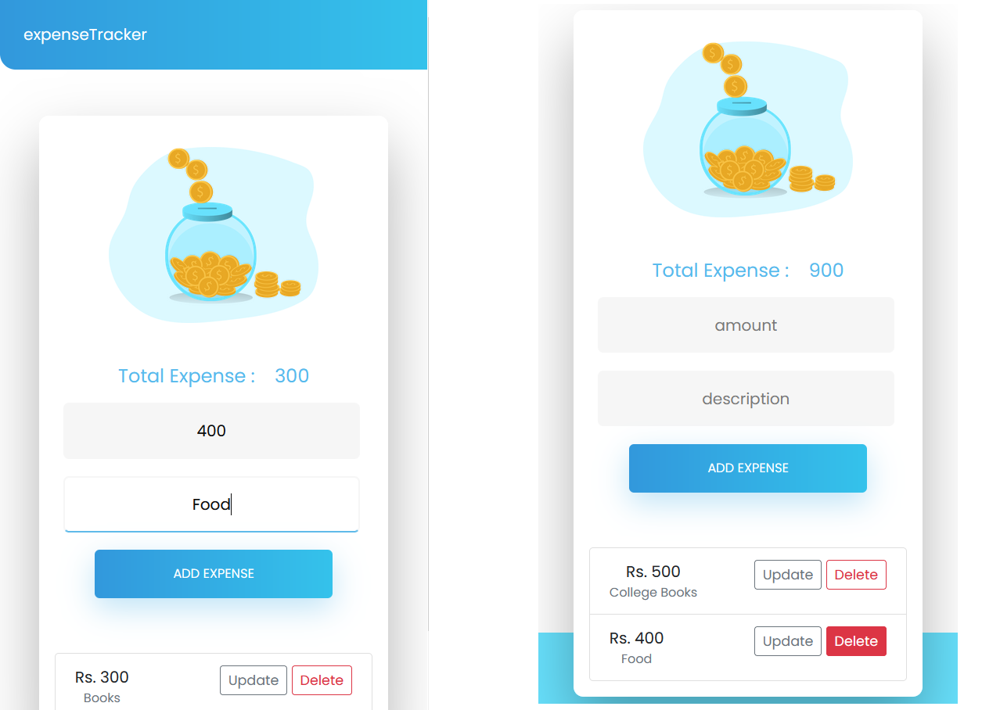

# Expense Tracker app

### A basic Expense Tracker app with CRUD functionailities
- Built a REST API using Flask
- Built Frontend using JavaScript, HTML and CSS
- MySQL database used

### Output screenshots:

